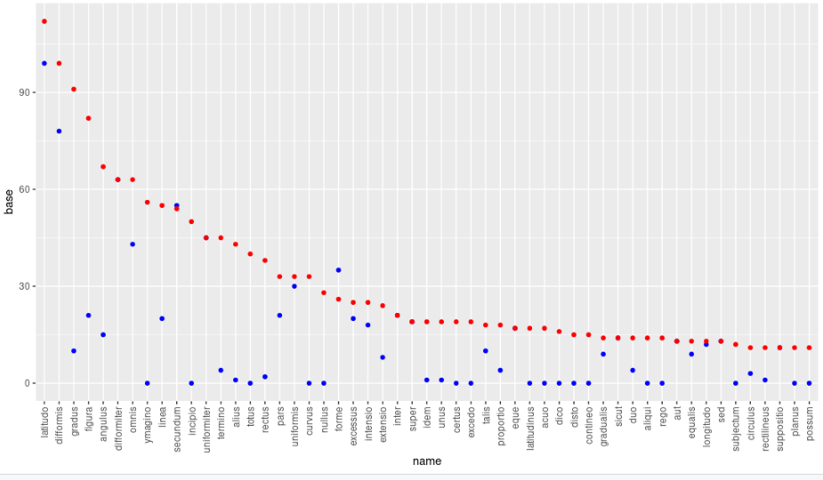
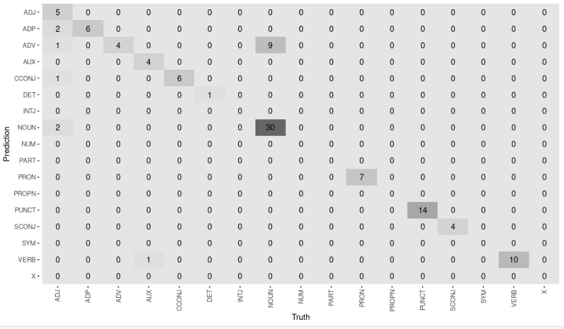

```{r setup, include=FALSE}
knitr::opts_chunk$set(echo = TRUE)
```

## Motivation
The aim of this project is to explore the usefulness of modern NLP techniques to the field of Medieval Philosophy and to learn to which extent the Latin language is covered in the standard programming libraries.

This use case is motivated by my previous experiences as a research assistant in Medieval Philosophy. From a practical view point, the field of Medieval Philosophy or Medieval Studies in general consists mainly in textual work: identifying relevant manuscripts in archives, creating a transliteration, composing the most likely original text from different sources, compiling a critical edition, translating the Latin text to a modern language, providing an interpretation.

As a rule, Academics working in this field are highly specialized professionals, commanding a set of skills particular to their subject. However, more often than not, advanced computer skills are lacking. Reversely, NLP researchers rarely come in contact with the niche field of Medieval Philosophy. This project is a first attempt to bridge the gap.


### Corpus
I will consider a small corpus of texts that I am familiar with from previous philosophical research work and editing tasks. The **Latitudines breves** consist of three short epitomes to Nicole Oresme's geometrical works *De configurationibus* and *Tractatus de latitudinibus formarum*, basically a compilation of the main theses for study purposes.

A critical edition of the texts with commentary can be retrieved from:
<https://www.academia.edu/35998894/The_Latitudines_breves_and_Late_Medieval_University_Teaching>

The application of NLP techniques to the *Latitudines breves* has the potential to yield true value to researchers. The three texts were independently passed down to us through various manuscripts. Statistical methods can provide a means to prove that they constitute a thematic cluster and can be used to discuss the question of authorship. These advanced goals, unfortunately, will not be reached within the scope of this project. 

## Problem to solve
This project attempts to solve two problems:

* To establish techniques for creating a clean base text.
* To evaluate the performance of the Latin text annotation models provided in the R package `udpipe`.

Source material in the field of Medieval Philosophy usually comes in one of three forms: medieval manuscripts (best case: scan of microfilm available), printed editions from before the advent of personal computers (best case: scan available; usually bad performance of OCR techniques), digital critical editions (usually a PDF). Extracting text from the former two sources would require advanced computer vision techniques and is ignored for this project.

However, extracting a base text from a digital critical edition is not straightforward either: Critical editions are enriched with contextual annotations, e.g. about the source material and page breaks in the manuscripts, with text variants, insertions and comments of the editor and references added by the editor. The challenge is to establish efficient techniques to recover the base text from the critical edition.

## Experiments done
To solve the first problem, several manual data cleaning tasks had to be applied:
* Remove headlines
* Replace ligatures
* Remove references
* Remove critical notes
* Remove footnotes
* Remove figure captions
* Remove lines with figure labels
* Remove comments from copyist
* Remove Siglae
* Remove word breaks at EOL
* Remove folio delimiter
* Remove additions of editor
* Remove text in brackets
* Remove ordinal numbers
* Remove quotation marks


The second problem required the application of the pre-trained annotation model `latin-ittb`, provided by the library `udpipe`. This resulted in the tokenization and annotation of the full corpus. Using this results, two experiments were run:

**Compare base tdm with tdm after lemmatization via udmodel**
The `latin-ittb` model provided a lemma to each token -- a functionality similar to stemming of the English language. The goal of this experiment was to evaluate to which extent the document-term matrix profits from lemmatization.

To this end, the document-term matrices for the base corpus and for the lemmatized corpus were calculated and graphically compared. (See analysis of results.)


**Evaluate UPOS annotation via confusion matrix on manually created labels.**
Furthermore, the `latin-ittb` model predicted UPOS for each token in the corpus. The goal of this experiment was to get a first approximation of the *accuracy* of the model when applied to a text in medieval latin. 

To this end, a very small set of true labels (for 107 tokens) was created manually and the confusion matrix plotted.

## Analysis of results

**Data cleaning**
The data cleaning proved to be harder than expected but eventually was successful.

First text after cleaning:
>liber latitudinum formarum, qui subordinatur phylosophie speculative medie inter physicam et geometriam, secundum aliquos quia latitudo est terminus geometrie et forme terminus physice. utilitas istius scientie est ad intelligendum multas partes physice ad alterationem, an fiat secundum intensum vel remissum, et ad materiam tertii physicorum. et nota: gradualis intensio forme dicitur eius latitudo, et sic intensio gradualis et latitudo gradualis supponunt pro eadem et similiter latitudo forme. non tamen sinonime, quia ly latitudo forme non est absolute intensio gradualis, sed connotat relative talem intensionem esse ymaginabilem per figuram geometricam et extensam. et non solum forma est latitudinabilis quo ad eius intensionem sed etiam motus localis et forma substantialis quo ad fieri vel mutari. consequenter intensio gradualis forme vocatur eius latitudo; eius vero extensio quo ad subiectum vel quo ad durationem vocatur longitudo. extensio mensuratur per lineam in subiecto, latitudo autem aut intensio per lineam perpendiculariter super eandem lineam erectam. linea non perpendiculariter data aut alia existens non est latitudo adquisita quo ad subiectum et sit fuerit acquisita, tunc illomodo, quia alias esset latitudo sine longitudine, quod est impossibile. et sic arguitur longitudo notior est ibi quam latitudo quia facilius scimus extensionem rei quam intensionem. latitudinum quedam uniformis, quedam difformis. uniformis est que est eiusdem gradus per totum, ut ibi sunt equales gradus in omnibus partibus . latitudo difformis est que non est eiusdem gradus per totum, ut ibi . latitudinum difformium quedam est secundum se totam difformis, quedam non secundum se totam difformis. prima est cuius nulla pars est precise uniformis, ut , ita quod nulla pars tot gradus sicut alia. secunda est cuius aliqua est difformis, ut . dicitur secundum partes difformis, quia non valet omnes, cum due sunt uniformes. latitudinum secundum se totas difformium quedam est difformiter difformis, quedam uniformiter difformis. latitudo uniformiter difformis est illa cuius est equalis excessus gradum inter se eque distantium, ut . latitudo difformiter difformis est cuius non est equalis excessus graduum inter se eque distantium, ut quia non est equalis excessus quattuor ad triam sicut tria ad unum, quia quattuor ad triam excessus est sesquitertius sed tria ad v unum est sesquialter . latitudinum uniformiter difformis quedam incipit a non gradu, id est ab infinita modica parte, et terminatur ad certum gradum. alia incipit a certo gradu et terminatur a non gradum, ut . sed nulla incipit a non gradu et terminatur ad non gradum, quia talis non est uniformiter difformis, quia in principio intenditur et in fine remittitur . latitudinum difformiter difformium quedam secundum se totam difformiter difformis, quedam vero non. latitudo secundum se totam difformiter difformis est illa cuius nulla pars est precise uniformiter difformis, ut . latitudo vero non secundum se totam difformiter difformis est illa cuius aliqua pars est uniformiter difformis, ut hic . latitudinum secundum se totas difformiter difformium quedam est uniformiter difformiter difformis, quedam difformiter difformiter difformis. notandum quod sicut ymaginatur quandam latitudinem in ulla sui parte variatam , quam vocatur difformem, ita quod si uniformiter varietur, vocatur latitudo uniformiter difformis, ita convenienter ymaginemur etiam quandam variationem latitudinis uniformem et quandam difformem; unde rursus variationem difformem, quandam uniformiter difformem, quandam difformiter difformem. et sicut uniformis variatio reddit latitudinem uniformiter difformem, sic difformis variatio latitudinis reddit latitudinem difformiter difformem. latitudo uniformiter difformiter difformis est que inter excessus graduum inter se eque distantium servat eandem proportionem aliam tamen a proportione equalitatis, quia si servaret eandem proportionem inter excessus graduum eque distantium tunc esset latitudo uniformiter difformis. et si nulla servaret uniformitas attendi in latitudine tali, et sic non esset uniformiter difformiter difformis. aliter sic dicitur: est latitudo in qua datis quibuscunque quattuor punctis equalibus extensis eque distantibus quo ad subiectum vel successionem quo ad tempus intensio excessus primi ad secundum habet se in eadem proportione inequalitatis ad excessum secundi ad tertium usque excessus secundi ad tertium habet se sicut ad excessum tertii ad quartum, et sic consequenter de aliis. r latitudo uniformis est que est eiusdem gradus per totum, ut in exemplo : difformis est que non est eiusdem gradus per totum : latitudo secundum se totam difformis cuius nulla pars est uniformis . latitudo autem non secundum se totam difformis est cuius aliqua pars est difformis et alia uniformis : latitudo uniformiter difformiter est cuius equalis est excessus gradium inter se eque distantium : latitudo difformiter difformis cuius non est equalis excessus graduum inter se eque distantium : latitudo secundum se totam difformiter difformiter difformis est que inter excessus graduum inter se eque distantium non servat eandem proportionem aliam a proportione equalitatis, ut in isto exemplo : latitudo secundum se totam uniformiter difformiter difformis est que inter excessus graduum inter se eque distantium servat eandem proportionem aliam tamen a proportione equalitatis, ut ibi : item quedam latitudo incipit a non gradu et terminatur ad non gradum, ut ibi : quedam incipit a certo gradu et terminatur ad certum gradum, ut ibi : quedam incipit a certo gradu et terminatur ad non gradum, ut ibi : quedam econtrario incipit a non gradu et terminatur ad certum gradum, ut ibi  


**Compare base tdm with tdm after lemmatization via udmodel**



**Evaluate UPOS annotation via confusion matrix on manually created labels.**


